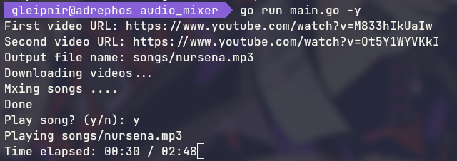

# Audio Mixer

This project is an audio mixer that takes two mp3 files and mix them into a new file

## Installation
For the Installation ensure that you have [ffmpeg](https://ffmpeg.org/download.html) tool installed on your device,
then simply clone this repository and build the project:
```
git clone https://github.com/Adrephos/audio_mixer
cd audio_mixer
go build
```
And run it:
```
./audio_mixer <FILE1> <FILE2> <OUTPUT_FILE>
```
If you want to mix and play the song use the following flag:
```
./audio_mixer -p <FILE1> <FILE2> <OUTPUT_FILE>
```
The last way of mixing two audio files is by a YouTube URL. You can use this feature with the `-y` flag
as shown in this example:


